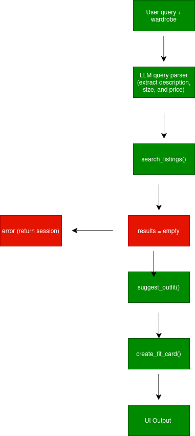

# FitFindr — planning.md

> Complete this document before writing any implementation code.
> Your spec and agent diagram are what you'll use to direct AI tools (Claude, Copilot, etc.) to generate your implementation — the more specific they are, the more useful the generated code will be.
> Your planning.md will be reviewed as part of your submission.
> Update it before starting any stretch features.

---

## Tools

List every tool your agent will use. For each tool, fill in all four fields.
You must have at least 3 tools. The three required tools are listed — add any additional tools below them.

### Tool 1: search_listings

**What it does:**
<!-- Describe what this tool does in 1–2 sentences -->
Searches clothing listings for items that match what the user is looking for. Filters by price, size, and then scores each result and returns the best match.

**Input parameters:**
<!-- List each parameter, its type, and what it represents -->
- `description` (str): what the user is looking for in plain English. For example, they could search "vintage led zeppelin shirt". This is used to match against the listing title and description.
- `size` (str or None): the size to filter by, like "M" or "L". Matching is case-insensitive and substring-based so "M" matches "S/M". Passing `None` skips size filtering.
- `max_price` (float or None): the maximum price the user will pay, whic is inclusive. Pass `None` to skip price filtering.

**What it returns:**
<!-- Describe the return value — what fields does a result contain? -->
A list of dicts sorted by relevance score, where the best match will be first. Each dict has `id`, `title`, `description`, `category`, `style_tags` (list), `size`, `condition`, `price` (float), `colors` (list), `brand` (or null), and `platform`. Returns empty list if nothing matches.

**What happens if it fails or returns nothing:**
<!-- What should the agent do if no listings match? -->
If the list is empty the planning loop sets `session["error"]` to a message like "No listings found for 'vintage shirts' under $30. Try removing the size filter, raising your budget, or using different keywords." Then it returns the session without calling the other two tools.

---

### Tool 2: suggest_outfit

**What it does:**
<!-- Describe what this tool does in 1–2 sentences -->
Takes the selected item and the user's wardrobe into to consideration then asks the model to suggest 1–2 complete outfits. If the wardrobe is empty it falls back to general styling advice instead of failing outright.

**Input parameters:**
<!-- List each parameter, its type, and what it represents -->
- `new_item` (dict): the top listing from `search_listings`. The prompt uses `title`, `category`, `style_tags`, `colors`, and `condition`.
- `wardrobe` (dict): has an `"items"` key with a list of wardrobe item dicts. Each item has `id`, `name`, `category`, `colors` (list), `style_tags` (list), and optional `notes`. The list may be empty.

**What it returns:**
<!-- Describe the return value -->
A non-empty string. If the wardrobe has items it names specific clothing items and describes how to combine them with the new item. If the wardrobe is empty it gives general advice like what styles pair well with the item's color. Never returns just an empty string.

**What happens if it fails or returns nothing:**
<!-- What should the agent do if the wardrobe is empty or no outfit can be suggested? -->
If the LLM call throws an exception it returns a message like "Outfit suggestion unavailable. Try pairing this with your current wardrobe." The agent still calls `create_fit_card`.

---

### Tool 3: create_fit_card

**What it does:**
<!-- Describe what this tool does in 1–2 sentences -->
Generates a short and causal 2 to 4 sentence social media caption for the thrifted find. It should sound like a real post written by a human rather than a product listing. Runs at a higher temp so outputs vary between calls.

**Input parameters:**
<!-- List each parameter, its type, and what it represents -->
- `outfit` (str): the suggestion string from `suggest_outfit`. If this is empty the function returns an error string without calling the LLM.
- `new_item` (dict): the listing dict. The prompt uses `title`, `price`, `platform`, `style_tags`, and `condition`.

**What it returns:**
<!-- Describe the return value -->
A 2 to 4 sentence caption that mentions the item name, price, and sounds casual while describing the vibe of the outfit itself. Example: "thrifted this faded band tee off depop for $22 and honestly it fits the grunge look I was going for." Uses temperature 0.9 or higher so it doesn't repeat the same phrasing every run. If `outfit` is empty, returns `"Cannot generate fit card: no outfit suggestion provided."`

**What happens if it fails or returns nothing:**
<!-- What should the agent do if the outfit data is incomplete? -->
If the LLM throws an exception, returns `"Fit card generation failed. Please try again."` The agent stores whatever string came back in the session and returns instead of just outright crashing.
---

### Additional Tools (if any)

<!-- Copy the block above for any tools beyond the required three -->
N/A

---

## Planning Loop

**How does your agent decide which tool to call next?**
<!-- Describe the logic your planning loop uses. What does it look at? What conditions change its behavior? How does it know when it's done? -->

The loop really just depends on whether the tool `search_listings` comes back empty.

1. Parse query - Send the user's raw text to the LLM and ask it to extract `description`, `size`, and `max_price` as JSON. Store that in `session["parsed"]`.
2. Call the tool, `search_listings` with the parsed values. Store the results in `session["search_results"]`.
3. Then it checks if results is empty. If yes, set `session["error"]` to a message explaining what failed and what suggests what to try instead. It will NOT call `suggest_outfit` or `create_fit_card`.
4. If results is non-empty, set `session["selected_item"]` to `results[0]` (the top match) and continue.
5. Call `suggest_outfit` with the selected item and the wardrobe in mind. Store string in `session["outfit_suggestion"]`.
6. Call `create_fit_card` with the outfit string and selected item. Store the string in `session["fit_card"]`.
7. Return the session. `session["error"]` will be `None` on the happy path.
The agent always calls tools in this order when results actually exist.

---

## State Management

**How does information from one tool get passed to the next?**
<!-- Describe how your agent stores and accesses state within a session. What data is tracked? How is it passed between tool calls? -->

1. query is set by the caller and used by the LLM query parser, which produces parsed, which is then used by search_listings.
2. search_results is set by search_listings and used by the planning loop to check if empty.
3. selected_item is set by the planning loop and used by both suggest_outfit and create_fit_card tools.
4. wardrobe is set by the caller on init and used by suggest_outfit, which produces outfit_suggestion, and is then used by create_fit_card.
5. fit_card is set by create_fit_card and error is set by the planning loop on early exit. app.py reads session["fit_card"], session["outfit_suggestion"], session["selected_item"], and session["error"] to produce the three outputs.

---

## Error Handling

For each tool, describe the specific failure mode you're handling and what the agent does in response.

| Tool | Failure mode | Agent response |
|------|-------------|----------------|
| `search_listings` | No results match query | Sets `session["error"]` to a specific message telling the user what to try differently (remove size filter, raise budget, change keywords). Returns WITHOUT calling the other tools. |
| `suggest_outfit` | Wardrobe is empty | Calls the LLM with a different prompt asking for general styling advice for the item type and color. Returns that string which would be a success, continues to `create_fit_card`. |
| `create_fit_card` | `outfit` string is empty | Returns `"Cannot generate fit card: no outfit suggestion provided."` without calling the LLM. Stored in `session["fit_card"]` agent returns normally. |

---

## Architecture

<!-- Draw a diagram of your agent showing how the components connect:
     User input → Planning Loop → Tools (search_listings, suggest_outfit, create_fit_card)
                                                                          ↕
                                                                   State / Session
     Show what triggers each tool, how state flows between them, and where error paths branch off.
     ASCII art, a Mermaid diagram (https://mermaid.js.org/syntax/flowchart.html), or an embedded
     sketch are all fine. You'll share this diagram with an AI tool when asking it to implement
     the planning loop and each individual tool. -->

## AI Tool Plan

<!-- For each part of the implementation below, describe:
     - Which AI tool you plan to use (Claude, Copilot, ChatGPT, etc.)
     - What you'll give it as input (which sections of this planning.md, your agent diagram)
     - What you expect it to produce
     - How you'll verify the output matches your spec before moving on

     "I'll use AI to help me code" is not a plan.
     "I'll give Claude my Tool 1 spec (inputs, return value, failure mode) and ask it to implement
     search_listings() using load_listings() from the data loader — then test it against 3 queries
     before trusting it" is a plan. -->

**Milestone 3: Individual tool implementations**

For `search_listings` I'll give Claude the Tool 1 section and have it write the function body in `tools.py` using `load_listings()` from `utils/data_loader.py`. Before I actually run anything I want to make sure it filters by `max_price` and `size`, scores results by keyword overlap with `description`, skips anything with a score of zero, and returns an empty list instead of crashing when nothing matches. Then I'll run three quick tests. One with a normal query, one where I set a tight price limit, and one that's impossible to match.

For `suggest_outfit` I'll give Claude the Tool 2 section along with the wardrobe schema and have it use the Groq client from `_get_groq_client()`. This is to see two separate prompt branches in the code depending on whether the wardrobe is empty or not, and the LLM call should be wrapped in a `try/except`. I'll test it using `get_example_wardrobe()` and `get_empty_wardrobe()` to make sure both paths work.

For `create_fit_card` I'll give Claude the Tool 3 section and ask for temperature at least 0.9. I'll check that there's a guard for an empty outfit, that the prompt actually uses the item's `title`, `price`, and `platform`, and that the tone instruction is in there. I'll run it three times on the same input to make sure the output actually changes each time.

**Milestone 4: Planning loop and state management**

I'll give Claude the Planning Loop and State Management sections plus the diagram and ask it to write `run_agent()` in `agent.py`. I'll make it clear in my prompt that `suggest_outfit` should not get called when `search_results` is empty. Once I have the code I'll check that it calls `_new_session()`, handles the empty results case, saves `results[0]` into `selected_item`, and runs the three tools in the right order. I'll test it using the two cases already in `agent.py`, one where everything works and one where nothing comes back from search.

---

## A Complete Interaction (Step by Step)

Write out what a full user interaction looks like from start to finish — tool call by tool call. Use a specific example query.

**Example user query:** "I'm looking for a vintage graphic tee under $30. I mostly wear baggy jeans and chunky sneakers. What's out there and how would I style it?"

**Step 1:**
<!-- What does the agent do first? Which tool is called? With what input? -->
The planning loop sends the user's query to the LLM to parse it. It comes back with `description = "vintage graphic shirt"`, `size = null`, `max_price = 30.0` and that gets saved into `session["parsed"]`. Since the user didn't mention a size, size filtering gets skipped entirely.

**Step 2:**
<!-- What happens next? What was returned from step 1? What tool is called now? -->
`search_listings` runs with those parsed values. It loads up all the listings, filters out anything over $30, scores what's left by how much the description overlaps with "vintage graphic shirt", and returns the matches sorted from best to worst. In this case it gives back the Y2K Graphic Shirt at $18 from Depop first and a Faded Band Shirt at $22 second. `session["search_results"]` gets set to that list, and since it's not empty the agent keeps going. `session["selected_item"]` is set to the Y2K Graphic Shirt.

**Step 3:**
<!-- Continue until the full interaction is complete -->
`suggest_outfit` gets called with the Y2K Graphic Shirt and the user's wardrobe. The wardrobe is not empty so the LLM gets a prompt that lists all those pieces together with the new shirt. It comes back with something like "Pair this graphic shirt with your wide-leg jeans and chunky sneakers for an early-2000s look. Front-tuck the hem a little and throw on a small shoulder bag to keep the proportions feeling right." That gets saved into `session["outfit_suggestion"]`.

**Step 4:**
`create_fit_card` is called with that outfit suggestion and the Y2K Graphic Shirt info. Since the outfit string is not empty the LLM runs at temperature 0.95 and comes back with something like "thrifted this y2k graphic shirt off depop for $18 and honestly it's so good. styled it with my wide-legs and chunky sneakers, full look on my stories." That gets saved into `session["fit_card"]`.

**Final output to user:**
<!-- What does the user actually see at the end? -->
The Gradio interface shows three panels. **Found item** shows "Y2K Graphic Shirt, $18, Depop, excellent condition." **Outfit suggestion** shows the styling advice from Step 3. **Fit card** shows the caption from Step 4. `session["error"]` is `None`.

